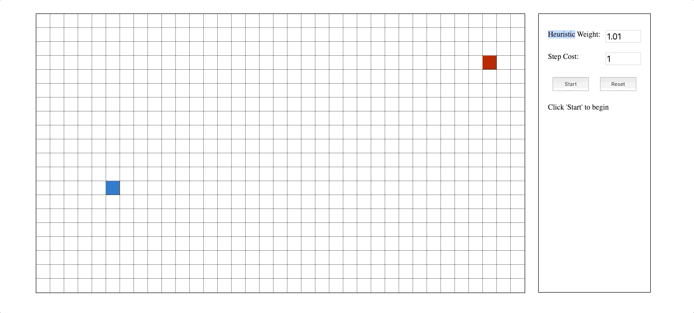

# A* Search Visualizer

An Interactive A* Search Algorithm Visualizer built with simple HTML & JavaScript.

## Getting Started

It's an HTML & JS Project! Simply clone the repo & open index.html

### Usage

The search algorithm will find the shortest path from the starting(blue) node to the goal(red) node. Drag & drop the nodes to edit.

Clicking & dragging on empty squares will draw barriers, and doing the same on barriers will erase them. The search algorithm uses Manhattan Distance as its heuristic.
